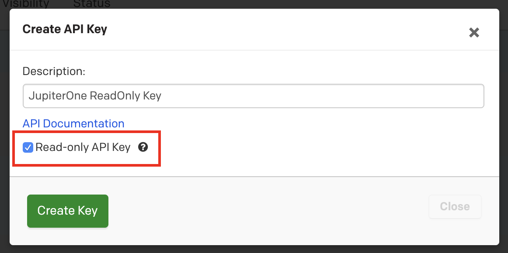

# Development

This integration uses the
[PagerDuty API](https://developer.pagerduty.com/api-reference/), on PagerDuty's
documentation the supply a sample API key allowing you to make requests to their
API.

## Prerequisites

Aside from what is documented in the [README](../README.md), no special tooling
is required to run and test this integration.

## Provider account setup

To setup a PagerDuty account for development, please take the following steps:

1. Visit the [PagerDuty](https://www.pagerduty.com/sign-up/) site.
1. Fill out the Trial sign up form then click `Get Started`.
1. Go through PagerDuty's getting started steps until you reach the dashboard.

## Authentication

Once you've created your account, you'll need to generate an API Key to access
the PagerDuty API.

Visit https://support.pagerduty.com/docs/generating-api-keys and follow the
instructions to create a `REST API Key`. _When creating the API Key be sure to
check Read Only Access_



Once you have your API Key requests against PagerDuty's API looks like the
following:

```bash
curl --location --request GET 'https://api.pagerduty.com/{resource}' \
--header 'Authorization: Token token={apiKey}'
```

`Resource` is the PagerDuty resource that you are requesting such as users,
teams, or services and `apiKey` is the PagerDuty api token previously generated.

For more examples the PagerDuty API can be found
[here](https://developer.pagerduty.com/api-reference/).

## Testing

The PagerDuty API calls can return **sensitive information** such as **names, emails, and phone numbers**. As a result, **be sure to scrub the responses of your PagerDuty API calls within your tests of sensitive information**. The current tests have already had their Polly HAR files cleaned of sensitive information.
